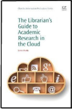
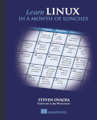

<table border="0">

|         |             | 
| ------------- |-------------| 
|       | [*The Librarian's Guide to Academic Research in the Cloud*](https://www.amazon.com/Librarians-Academic-Research-Information-Professional/dp/1843347156/ref=sr_1_1?ie=UTF8&qid=1527698758&sr=8-1&keywords=ovadia+librarian+cloud) (Chandos, 2013): A practical guide to using cloud-based services for research, from a librarian's perspective. The book is about tools, but is also about workflow and writing/researching efficiently.|
|       | [*Learn Linux in a Month of Lunches*](https://www.manning.com/ovadia) (Manning, 2016): A guide to learning Linux for non-technical users. It breaks down what might be an intimidating process into manageable lessons. It discusses the philosophy behind Linux and free and open source software, including the importance of choice when choosing tools. Features an introduction from RedHat's Jim Whitehurst.|

</table>
